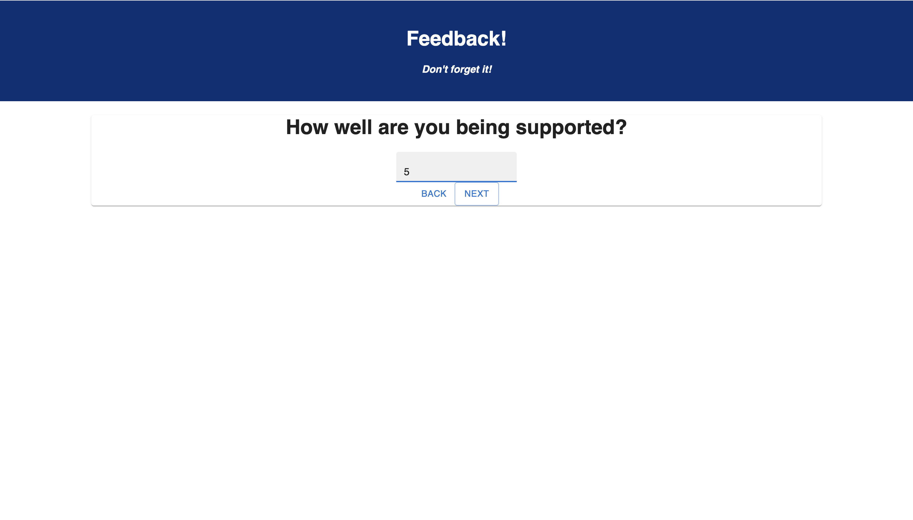

# Project Name 
Redux-Feedback-loop

## Description
This web application took about three days to complete

The main concept this weekend's project was react-redux, learning about the global state was challenging, honestly understanding what state was challenging. However after completing this project I have a much better grasp of both of concepts and am glad for it!

## Installation
1-Fork/Clone
2-Create a database "prime_feedback"
3-Npm install the dependencies
4-Npm run server
5-npm run client

Your localhost 3000 should opened in your primary browser, in which case you may take the questionnaire. 
Thank you!

## Pre-requisites
1. [Node.js] (https://nodejs.org/en/)
2. [PostgreSQL](https://www.postgresql.org/)
3. [Postico] (https://https://eggerapps.at/postico/)

## Usage
This is an application in which users are giving feedback based on some task that they've done. It asks them a series of question in which they have to give an answer in order to continue (except for the comment view). The application uses the global state to store each input and finally displays it on a submit page which ultimately sends the information to the database. 

I have also made an admin page in which the admin can go through and delete certain submission on a case by case circumstance. You would have to use '/admin' to check that out.

## Screenshots

## Built With

1. [Node.js](https://nodejs.org/en/)
2. [Express](https://expressjs.com/)
3. [React](https://reactjs.org/)
4. [Redux](https://redux.js.org/)
6. [PostgreSQL](https://www.postgresql.org/)
7. [Material-UI](https://mui.com/)

## Acknowledge 
Thanks to Prime Digital Academy who equipped and helped me to make this application a reality.
